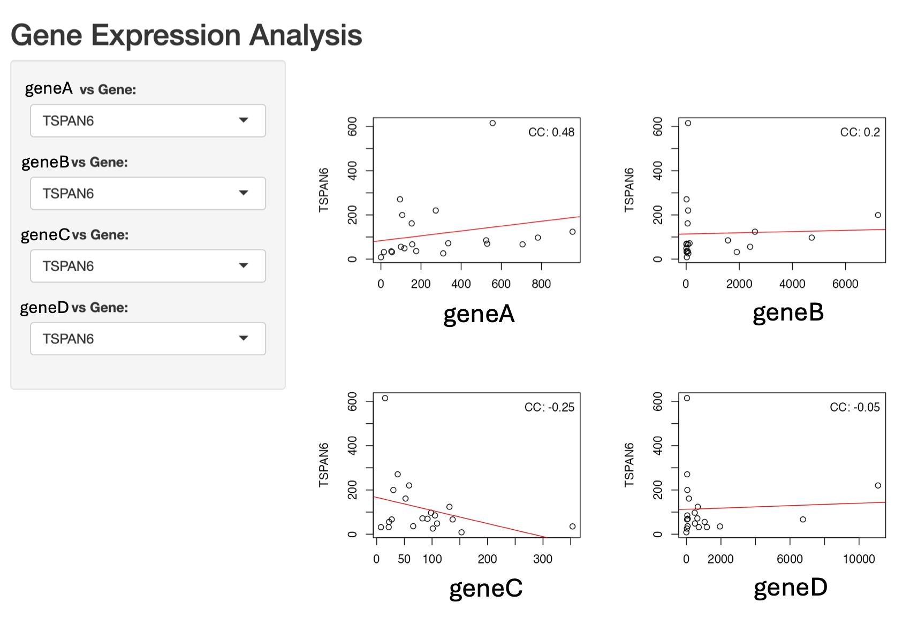

```{r setup, include=FALSE}
knitr::opts_chunk$set(echo=T, fig.align = "center", 
                      eval = F,
                      message=F, warning=F,
                      results = "markup",
                      error = TRUE,
                      highlight = TRUE,
                      prompt = FALSE,
                      tidy = FALSE)
```

# Introduction 

This is a simple R Shiny app including 4 scatter plots of gene-gene expression.  
This is not a working code, but the guideline for each step to build a shiny app.  
Local run only.  


# Load the Shiny library

```{r}
library(shiny)
library(dplyr)
library(ggplot2)
```


# Set the data directory

```{r}
dir <- "~/Desktop/figure/"
tpm = read.csv(paste0(dir,"your_tpm_file"), row.names = 1)
```


# Create functions  
```{r}
# Create functions
scatterplot_geneA <- function(tpm, gene_y) {
  geneA ="your gene"
  subset_df <-data.frame(t(tpm[c(geneA, gene_y),]))
  plot(subset_df[, 1], subset_df[, 2], xlab = geneA, ylab = gene_y)
  correlation_coefficient <- cor(subset_df[, 1], subset_df[, 2], method = "spearman")
  abline(lm(subset_df[, 2] ~ subset_df[, 1]), col = "red")
  legend("topright", legend = paste("CC:", round(correlation_coefficient, 2)), bty = "n")
}

# Create functions
scatterplot_geneB <- function(tpm, gene_y) {
  geneB ="your gene"
  subset_df <-data.frame(t(tpm[c(geneB, gene_y),]))
  plot(subset_df[, 1], subset_df[, 2], xlab = geneB, ylab = gene_y)
  correlation_coefficient <- cor(subset_df[, 1], subset_df[, 2], method = "spearman")
  abline(lm(subset_df[, 2] ~ subset_df[, 1]), col = "red")
  legend("topright", legend = paste("CC:", round(correlation_coefficient, 2)), bty = "n")
}

scatterplot_geneC <- function(tpm, gene_y) {
  geneC ="your gene"
  subset_df <-data.frame(t(tpm[c(geneC, gene_y),]))
  plot(subset_df[, 1], subset_df[, 2], xlab = geneC, ylab = gene_y)
  correlation_coefficient <- cor(subset_df[, 1], subset_df[, 2], method = "spearman")
  abline(lm(subset_df[, 2] ~ subset_df[, 1]), col = "red")
  legend("topright", legend = paste("CC:", round(correlation_coefficient, 2)), bty = "n")
}


# Create functions
scatterplot_geneD <- function(tpm, gene_y) {
  geneD ="your gene"
  subset_df <-data.frame(t(tpm[c(geneD, gene_y),]))
  plot(subset_df[, 1], subset_df[, 2], xlab = geneD, ylab = gene_y)
  correlation_coefficient <- cor(subset_df[, 1], subset_df[, 2], method = "spearman")
  abline(lm(subset_df[, 2] ~ subset_df[, 1]), col = "red")
  legend("topright", legend = paste("CC:", round(correlation_coefficient, 2)), bty = "n")
}

```

# Define the UI
```{r}
ui <- fluidPage(
  
  # App title
  titlePanel("Gene Expression Analysis"),
  
  # Sidebar layout
  sidebarLayout(
    sidebarPanel(
      # Gene selection for geneA plot
      selectInput("y_gene1", "geneA vs Gene:", choices = rownames(tpm)),
      # Gene selection for geneB plot
      selectInput("y_gene2", "geneB vs Gene:", choices = rownames(tpm)),
      # Gene selection for geneC plot
      selectInput("y_gene3", "geneC vs Gene:", choices = rownames(tpm)),
      # Gene selection for geneD plot
      selectInput("y_gene4", "geneD vs Gene:", choices = rownames(tpm))
    ),
    
    # Main layout
    mainPanel(
      fluidRow(
        # First row: geneA plot output
        column(width = 6, plotOutput("scatterplot_geneA", width = 300, height = 280)),
        # First row: geneB plot output
        column(width = 6, plotOutput("scatterplot_geneB", width = 300, height = 280))
      ),
      fluidRow(
        # Second row: geneC plot output
        column(width = 6, plotOutput("scatterplot_geneC", width = 300, height = 280)),
        # Second row: geneD plot output
        column(width = 6, plotOutput("scatterplot_geneD", width = 300, height = 280))
      )
    )
  )
)
```


# Define the server
```{r}
server <- function(input, output) {
  # Generate geneA plot
  output$scatterplot_geneA <- renderPlot({
    scatterplot_geneA(tpm, input$y_gene1)
  })
  
  # Generate geneB plot
  output$scatterplot_geneB <- renderPlot({
    scatterplot_geneB(tpm, input$y_gene2)
  })
  
  # Generate geneC plot
  output$scatterplot_geneC <- renderPlot({
    scatterplot_geneC(tpm, input$y_gene3)
  })
  
  # Generate geneD plot
  output$scatterplot_geneD <- renderPlot({
    scatterplot_geneD(tpm, input$y_gene4)
  })
}

```

# Run the Shiny app 
```{r}
shinyApp(ui = ui, server = server)
```


# Output will be like this    

<br>
 
<br>

<br><br>

