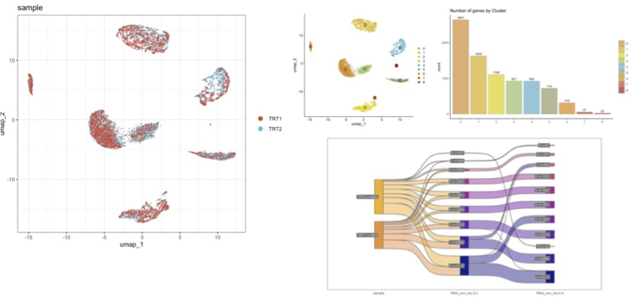
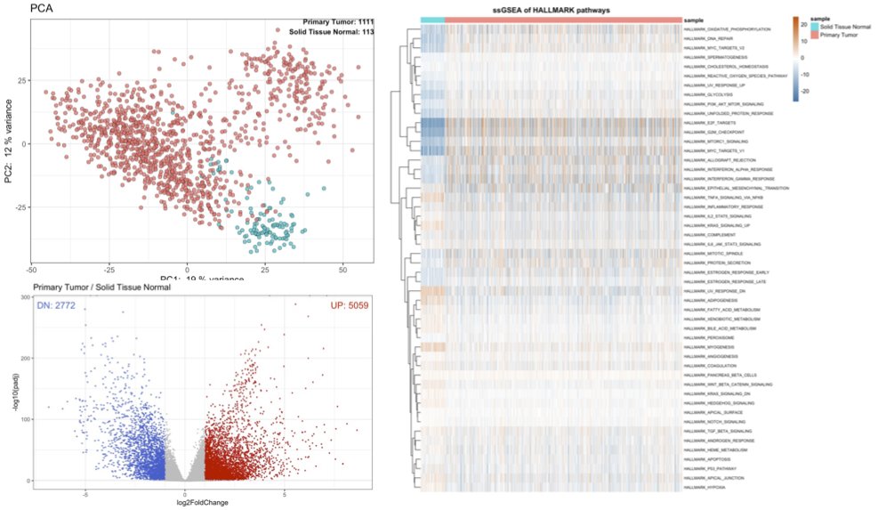
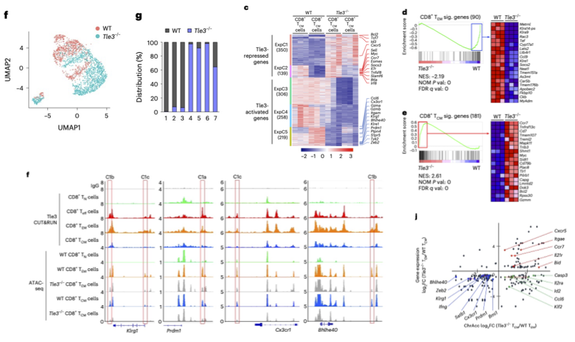
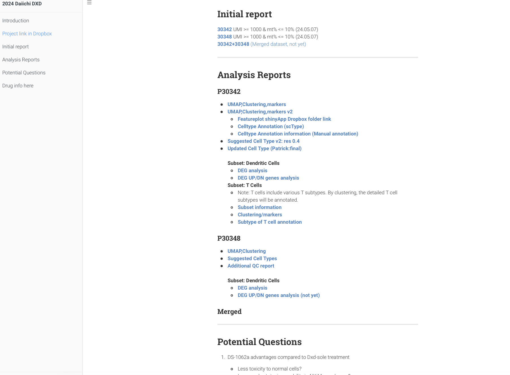

```{r setup, include=FALSE}
knitr::opts_chunk$set(echo = TRUE)
```
<hr>

<details><summary>Professional summary & resume</summary>

<br>
Experienced Senior Bioinformatics Scientist with a strong background in immunology and cancer biology research, specializing in leading bioinformatics projects from conception to completion. Extensive expertise in advanced NGS data integration, computational method design and cross-functional collaboration. Proven track record in delivering actionable insights to drive biological discovery, with first-author publications in Nature Immunology and Cell Reports. Skilled at coordinating multi-partner projects and managing pharmaceutical collaborations at Dana-Farber Cancer Institute. Recognized for exceptional analytical abilities and commitment to scientific understanding through innovative methodologies.
<br>
 

<a href="info/resume/SungryePark_resume.pdf" style="font-size: 14px;">Sung Rye Park's resume (pdf)</a><br>
<br>

</details> 

<hr>

### [Data Analysis workflow Overview](etc/General_workflow2.html)

1. scRNA-seq pipeline
2. RNA-seq pipeline
3. ChIP-seq/Cut&Run/ATAC-seq pipeline
4. Machine Learning application
5. Public DB

<br><hr>

### [Single Cell RNA-seq workflow](https://sung2021.github.io/works.io/samples/scRNA_index.html)

<!-- (https://sung2021.github.io/samplePages/scRNAseq.html)   -->


<br>
<br>

* Initial Processing 
  * QC Processing and initial filtering
    * UMI cutoff
    * Mitochondrial DNA cutoff
    * Doublet Removal (scrublet)
* Integration : harmony 
* UMAP/Clustering/Markers
* Cluster-markers enrichment analysis (GSEA)
* Cell type annotation (scType, singleR)
* Trajectory analysis
* AUC 
* Imputation


<hr>

### [RNA-seq workflow](samplePages/RNAseq.html) 

**Bulk RNA-seq workflow**<br>

* PCA
* TPM calculation
* DEG Analysis
* Gene set enrichment analysis (GESA, ssGSEA)
* Kmeans clustering
<br>

**Feature selection and ML**

  * [Machine Learning application to identify variable features in bulk RNA-seq data (Elastic Net)](https://sung2021.github.io/samplePages/Daiichi_bulk_RNASeq/Daiichi_2024_bulk_30342_ElasticNet_featureSelection.v2.html)
  * [Machine Learning application to identify important features and pattern in bulk RNA-seq data (kmeans clustering using DEGs)](https://sung2021.github.io/samplePages/Daiichi_bulk_RNASeq/Daiichi_2024_bulk_30342_DEG_kmeans_code.html)

<br>
**Example**

[RNA-seq Analysis using TCGA DB data](https://sung2021.github.io/works.io/samples/RNAseq/TCGA/TCGA_BRCA_RNAseq_index.html) 

<br>
<br><br>

<hr>

### Genomic data processing 
<a href="samplePages/ChIP_seq.html" style="font-size: 16px;">Data Processing : Applicable to ChIP-seq, ATAC-seq, Cut&Run</a><br>
<hr>

### TCR-seq workflow 

* [preprocessing](samplePages/TCR_seq.html)
* [scRNA-seq+scTCR-seq](https://sung2021.github.io/etc/DGKi_test_human.html)<br>
<!-- * [scRepertoire (preparing: package update recently)](samplePages/DGKi_scTCRSeq_scRepertoire2.html) -->

<hr>


### Publication Review 

[Tle3 as a co-activator (Nature Immunology,2024)](samplePages/NI.html)<br>
<br><br><br>


<!-- ### Work-related Information collections -->

<!-- ##### 1. [Immune Cell Type information (References)](https://sung2021.github.io/works.io/etc/Useful_info.html) -->
<!-- * B cell -->
<!-- * T cell (CD4/CD8) -->
<!-- * Myeloid cell (Macrophage,DC,etc) -->

<!-- ##### 2. [Drug Information (for DFCI projects)](https://sung2021.github.io/works.io/etc/Drug_info.html) -->
<!-- * DGKi -->
<!-- * DS-1062a -->
<!-- * TAK-676 -->
<!-- * ADU-S100 -->
<!-- * Pembrolizumab -->
<!-- * Nivolumab   -->
<!-- * CD47  -->

<!-- ##### 3. [TCGA-BRCA Metadata Column Description](info/TCGA/TCGA_BRCA_metadata_info.html) -->
<!-- * sample_type -->
<!-- * state -->
<!-- * tissue_type -->
<!-- * treatments -->
<!-- * more (Paper Attributes) -->
<br>
<hr>

### Miscellaneous

* [nf-core pipelines backup](samplePages/processing/nextflow_pipelines.html)
* [Data_Processing in Linux env](etc/Data_Processing.html)  
* [WDL example](etc/WDL_example.html)  
* [BCR-seq info (Antibody_discovery_Platform)](etc/Antibody_discovery_Platform.html)  
<!-- [Simple shiny app](samplePages/RShiny_app2.html)   -->
* [Basic Github usage](etc/Basic_github.html)  
* [cellranger docker setup](etc/cellranger_docker.html)  
<!-- [MAF analysis](https://sung2021.github.io/works.io/samples/TCGA_analysis.html) -->
<br>

<hr>

<!-- ### Learning new methods -->

<!-- [CRISPR Screening method comparison (Korean/English)](https://sung2021.github.io/works.io/etc/CRISPR.html) -->

<!-- <br> -->
<!-- <hr> -->

### Conference/Seminar Note   

**2024**

* [Conference Summary Report: 10X Genomics User Group Meeting 2024](https://sung2021.github.io/works.io/etc/Conf_10xGenomics_2024.May.html)<br>
<!-- &nbsp;&nbsp;&nbsp;[Conference Note : 2024 Festival in Genomics in Boston](https://sung2021.github.io/works.io/etc/FestivalBoston24_index.html)<br> -->

<br><br>
<hr>

### Project Tracking Example

<br>

<br><br>

<hr> 
### Public Pages 

[Github](https://github.com/Sung2021)<br> 
[LinkedIn](https://www.linkedin.com/in/sung-rye-park-8a130098/)<br>
<hr>


### First/co-first authorship publications (pdf) 

* <a href="info/papers/NI_Sung_s41590-023-01720-w_reduced_size2.pdf" style="font-size: 14px;">The transcriptional cofactor Tle3 reciprocally controls effector and central memory CD8+ T cell fates. (Nature Immunology, 2024)</a><br>
* <a href="info/papers/CellReports.2020.Sung_reduced_size2.pdf" style="font-size: 14px;">Single cell transcriptome analysis of colon cancer cell response to 5-fluorouracil-induced DNA damage (Cell Reports, 2020)</a><br>
* <a href="info/papers/American_Journal_of_Physiology.2020.Sung_reduced_size.pdf" style="font-size: 14px;">Holistic Characterization of Single Hepatocyte Transcriptome Responses to High Fat Diet (American Journal of Physiology-Endocrionlogy and Metabolism, 2020)</a><br>

<br><hr>


### Bioinformatics Skills  

<details><summary>List</summary>

* Proficient in a wide array of NGS data pipelines and bioinformatics analyses including scRNA-seq, scTCR-seq, CITE-Seq, ATAC-seq, bulk RNA-seq, as well as integrative approaches with TCGA and CCLE for genomic and epigenomic studies 
* Proficient in Linux, with programming skills in Python and R, and skilled use of bioinformatics tools including Cellranger, Salmon, and a suite of sequence alignment and analysis utilities 
* Well-versed in peak calling, genomic visualization, and analysis using open- source platforms such as Seurat, scanpy, and the USCC Genome Browser
* Expertise in pathway and network analysis to elucidate complex biological pathways, and statistical analysis for robust genomic data interpretation
* Familiarity with high-performance computing environments and adept at managing in-lab NGS pipelines, ensuring quality and reproducibility 
* Skilled in data visualization and presentation, utilizing tools like ggplot2, Shiny, and Rmarkdown, to effectively communicate complex data to diverse audiences 
* Expertise in immunology, oncology, and molecular biology with practical experience in public dataset analysis 
* Developed and maintained specialized assay platforms including Drop-seq, Seq-well, and Seq-scope
* Proficient in NGS library generation, particularly with single cell 10X genomics and RNA-seq
* Autonomous work style, efficiently conducting research with minimal oversight
Guiding and mentoring interns in bioinformatics practices and project work
* Consulting with collaborators to identify and apply novel bioinformatics analysis methods
* Managing documentation and workflow sharing across collaborative platforms
* Keeping meticulous records of both raw and processed data storage

<br>
</details>

<hr>

### Publications   

<details><summary>List</summary>

* The transcriptional cofactor Tle3 reciprocally controls effector and central memory CD8+ T cell fates. (Nature Immunology, 2024. X.Zhao, W.Hu, S.R.Park, S.Zhu, S.S.Hu, C.Zang, W.Peng, Q.Shan ,H.H. Xue. **co-first** (Zhao, W.Hu, Park and Zhu as co-first authors with equal contribution) (https://doi.org/10.1038/s41590-023-01720-w)
* SiftCell: A robust framework to detect and isolate cell-containing droplets from single-cell RNA sequence reads. (Cell Systems, 2023) Jingyue Xi, Sung Rye Park, Jun Hee Lee and Hyun Min Kang. (https://doi.org/10.1016/j.cels.2023.06.002)
* Sublethal whole-body irradiation induces permanent loss and dysfunction in pathgen-specific circulating memory CD8T cell populations. (PNAS, July 2023) Mohammad Heidarian, Iassac J Jensen, Shravan Kumar Kannan, Lecia L Pewe, Mariah Hassert, Sung Rye Park, Hai-Hui Xue, John Harty, Vladimir Badovinac. (https://doi.org/10.1073/pnas.2302785120.)
* Simultaneous loss of TSC1 and DEPDC5 in skeletal and cardiac muscles produces early-onset myopathy and cardiac dysfunction associated with oxidative damage and SQSTM1/p62 accumulation. (Autophagy, 2021) Chun-Seok Cho, Yongsung Kim, Sung-Rye Park, Boyoung Kim, Carol Davis, Irene Hwang, Susan V Brooks, Jun Hee Lee, Myungjin Kim. (https://doi.org/10.1080/15548627.2021.2016255)
* Seq-Scope: Microscopic examination of spatial transcriptome using Seq-Scope. (Cell, 2021) Chun-Seok Cho, Jingyue Xi, Yichen Si, Sung-Rye Park, Jer-En Hsu, Myungjin Kim, Goo Jun, Hyun-Min Kang, Jun Hee Lee. (https://doi.org/10.1016/j.cell.2021.05.010)
* Single cell transcriptome analysis of colon cancer cell response to 5-fluorouracil-induced DNA damage (Cell Reports, 2020) Sung Rye Park, Sim Namkoong, Zac Zezhi Zhang, Leon Friesen, Euisik Yoon, Chang H. Kim, Hojoong Kwak, Hyun Min Kang and Jun Hee Lee. (https://doi.org/10.1016/j.celrep.2020.108077)  **first**
* Holistic Characterization of Single Hepatocyte Transcriptome Responses to High Fat Diet (American Journal of Physiology-Endocrionlogy and Metabolism, 2020) Sung Rye Park, Chun-Seok Cho, Hyun Min Kang and Jun Hee Lee. (https://doi.org/10.1152/ajpendo.00391.2020)  **first**
* Concurrent activation of growth factor and nutrient arms of mTORC1 induces oxidative liver injury. Cell Discovery volume 5, Article number: 60 (2019) Chun-Seok Cho, Allison Ho, Sim Namkoong, Sung-Rye Park, Shuangcheng Wu, Boyoung Kim, Amanda James, Bondong Gu, Ian A. Semple, Mohamed A. Tohamy, Sumeet Solanki, Uhn-Soo Cho, Joel K. Greenson, Yatrik Shah, Myungjin Kim, Jun Hee Lee. (https://doi.org/10.1152/ajpendo.00391.2020)

</details>

### Education  <a id="education"></a>
* Ph.D. Plant Biology, University of Texas at Austin 2017
* MA. Biology Seoul National University 2010   

<br><br>

Last update: `r format(Sys.Date())`

<br><br>