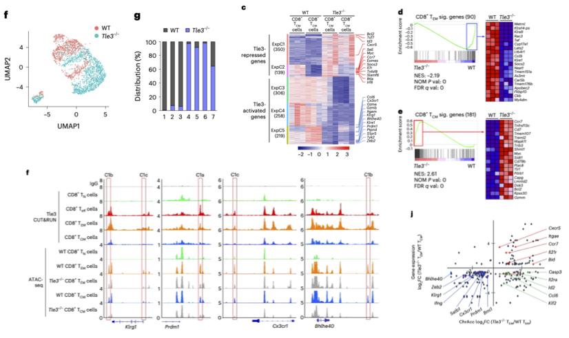
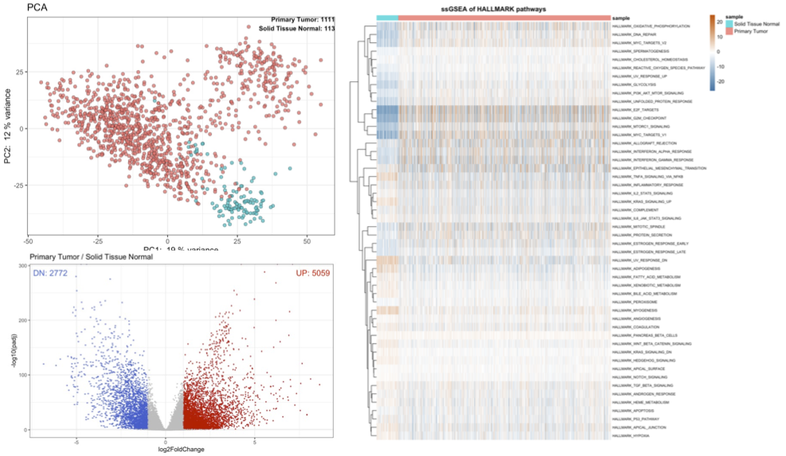

```{r setup, include=FALSE}
knitr::opts_chunk$set(echo = TRUE)
```
<br>

### Professional summary  

Currently Bioinformatics Scientist II at  **Dana Farber Cancer Institute**  
<br>
Experienced Senior Bioinformatics Scientist/Biologist, adept at leading and collaborating on diverse bioinformatics projects. Specialized in addressing questions related to combinational immunotherapy in cancer patients, discovering target cells and mechanisms, understanding T cell development, and modularizing analysis pipelines. Committed to fostering comprehensive collaboration to achieve project goals with non-bioinformatics scientists, enhancing both project outcomes and interdisciplinary team success. I have served as first or co-first author on several publications that explore biological insights using single-cell technologies, transcriptomics, and epigenomics, along with their integration. I am a relentless learner, continually updating my skills in new technologies such as data analysis from Xenium/Visium HD and antigen profiling platforms, as well as expanding my knowledge in diverse areas of biology including cancer mechanisms, diseases, and tissue studies.
<br>
 
<a href="info/resume/SungRyePark_resume.pdf" style="font-size: 18px;">Sung Rye Park's resume (pdf)</a><br>
<br>

### Work Sample pages 

<a href="samplePages/NI.html" style="font-size: 20px;">Tle3 as a co-activator (Nature Immunology work)</a><br>
<br><br><br>
<a href="https://sung2021.github.io/works.io/samples/scRNA_index.html" style="font-size: 20px;">single cell RNA-seq workflow</a><br>
<br><br><br>

<a href="samplePages/RNAseq.html" style="font-size: 20px;">bulk RNA-seq workflow</a><br>
<a href="samplePages/ChIP_seq.html" style="font-size: 20px;">ChIP-seq (applicable to ATAC-seq, Cut&Run)</a><br>

<a href="samplePages/TCR_seq.html" style="font-size: 20px;">TCR-seq</a>

  * [scRNA-seq+scTCR-seq](https://sung2021.github.io/etc/DGKi_test_human.html)<br>

<br>
<a href="https://sung2021.github.io/works.io/samples/RNAseq/TCGA/TCGA_BRCA_RNAseq_index.html" style="font-size: 20px;">TCGA-BRCA Transcriptome Analysis</a><br>
<br><br><br>

<!-- <a href="https://sung2021.github.io/works.io/samples/TCGA/TCGA_BRCA_CNV.html" style="font-size: 20px;">TCGA-BRCA CNV Analysis</a><br> -->
<!-- <br> -->
<a href="samplePages/Celltype.annotation.html" style="font-size: 20px;">Cell type annotation</a><br>
<br>


**Work-related Information collection**   
[Immune Cell Type information](https://sung2021.github.io/works.io/etc/Useful_info.html)<br> 
[Drug Information (that I study at DFCI)](https://sung2021.github.io/works.io/etc/Drug_info.html)<br>
<br>


**Miscellaneous**   
[Data_Processing in Linux env](etc/Data_Processing.html)  
[WDL example](etc/WDL_example.html)  
[BCR-seq info (Antibody_discovery_Platform)](etc/Antibody_discovery_Platform.html)  
[Simple shiny app](samplePages/RShiny_app2.html)  
[Basic Github usage](etc/Basic_github.html)  
[cellranger docker setup](etc/cellranger_docker.html)  
[Conference Summary Report: 10X Genomics User Group Meeting](https://sung2021.github.io/works.io/etc/Conf_10xGenomics_2024.May.html)<br>
[MAF analysis](https://sung2021.github.io/works.io/samples/TCGA_analysis.html)
<br>

<br><br>
<!-- **To be updated**    -->
<!-- <span style="font-size: 16px;">Plot gallery (will be updated) </span><br> -->

<br><br>


### Github  <a id="github"></a>     
https://github.com/Sung2021 

### LinkedIn Profile  <a id="linkedin"></a>   

<a href="https://www.linkedin.com/in/sung-rye-park-8a130098/" style="font-size: 18px;">Work History in LinkedIn</a><br>
<br><br>


## First/co-first authorship publications (pdf)  <a id="first_author"></a>  

<a href="info/papers/NI_Sung_s41590-023-01720-w_reduced_size2.pdf" style="font-size: 14px;">The transcriptional cofactor Tle3 reciprocally controls effector and central memory CD8+ T cell fates. (Nature Immunology, 2024)</a><br>

<a href="info/papers/CellReports.2020.Sung_reduced_size2.pdf" style="font-size: 14px;">Single cell transcriptome analysis of colon cancer cell response to 5-fluorouracil-induced DNA damage (Cell Reports, 2020)</a><br>

<a href="info/papers/American_Journal_of_Physiology.2020.Sung_reduced_size.pdf" style="font-size: 14px;">Holistic Characterization of Single Hepatocyte Transcriptome Responses to High Fat Diet (American Journal of Physiology-Endocrionlogy and Metabolism, 2020)</a><br>


<br>

## Skills  <a id="skills"></a>  
* Proficient in a wide array of NGS data pipelines and bioinformatics analyses including scRNA-seq, TCR-seq, CITE-Seq, ATAC-seq, bulk RNA-seq, as well as integrative approaches with TCGA and CCLE for genomic and epigenomic studies 
* Proficient in Linux, with programming skills in Python and R, and skilled use of bioinformatics tools including Cellranger, Salmon, and a suite of sequence alignment and analysis utilities 
* Well-versed in peak calling, genomic visualization, and analysis using open- source platforms such as Seurat, scanpy, and the USCC Genome Browser
* Expertise in pathway and network analysis to elucidate complex biological pathways, and statistical analysis for robust genomic data interpretation
* Familiarity with high-performance computing environments and adept at managing in-lab NGS pipelines, ensuring quality and reproducibility 
* Skilled in data visualization and presentation, utilizing tools like ggplot2, Shiny, and Rmarkdown, to effectively communicate complex data to diverse audiences 
* Expertise in immunology, oncology, and molecular biology with practical experience in public dataset analysis 
* Developed and maintained specialized assay platforms including Drop-seq, Seq-well, and Seq-scope
* Proficient in NGS library generation, particularly with single cell 10X genomics and RNA-seq
* Autonomous work style, efficiently conducting research with minimal oversight
Guiding and mentoring interns in bioinformatics practices and project work
* Consulting with collaborators to identify and apply novel bioinformatics analysis methods
* Managing documentation and workflow sharing across collaborative platforms
* Keeping meticulous records of both raw and processed data storage

<br>

## Experience  <a id="experience"></a>
* Senior Bioinformatics scientist at Dana Farber Cancer Institute 2022-  

  - DGK inhibitor efficacy testing in combination with Nivolumab for SCLC     
  - DS-1062 and Pembrolizumab testing for SCLC   
  - EZH2 inhibitor candidates searching using ChIP-seq   
  - Evaluation of STING agonist (ADU-100) effects in mouse PBMCs and the tumor immune environment   
  - TAK-676 and PD-1 blockade in SCLC   
  - Immune cell trafficking within in-house device culture   
  - Integrative analysis ofanti-CD47 therapy efficacy in PTCL-resistant mouse models   
  - Supporting manuscript writings.  
  - (more)
<br><br>

* Postdoctoral Fellow at Hackensack Meridian Health 
* Postdoctoral Fellow at University of Michigan

## Publications  <a id="publications"></a> 
* The transcriptional cofactor Tle3 reciprocally controls effector and central memory CD8+ T cell fates. (Nature Immunology, 2024. X.Zhao, W.Hu, S.R.Park, S.Zhu, S.S.Hu, C.Zang, W.Peng, Q.Shan ,H.H. Xue. **co-first** (Zhao, W.Hu, Park and Zhu as co-first authors with equal contribution) (https://doi.org/10.1038/s41590-023-01720-w)
* SiftCell: A robust framework to detect and isolate cell-containing droplets from single-cell RNA sequence reads. (Cell Systems, 2023) Jingyue Xi, Sung Rye Park, Jun Hee Lee and Hyun Min Kang. (https://doi.org/10.1016/j.cels.2023.06.002)
* Sublethal whole-body irradiation induces permanent loss and dysfunction in pathgen-specific circulating memory CD8T cell populations. (PNAS, July 2023) Mohammad Heidarian, Iassac J Jensen, Shravan Kumar Kannan, Lecia L Pewe, Mariah Hassert, Sung Rye Park, Hai-Hui Xue, John Harty, Vladimir Badovinac. (https://doi.org/10.1073/pnas.2302785120.)
* Simultaneous loss of TSC1 and DEPDC5 in skeletal and cardiac muscles produces early-onset myopathy and cardiac dysfunction associated with oxidative damage and SQSTM1/p62 accumulation. (Autophagy, 2021) Chun-Seok Cho, Yongsung Kim, Sung-Rye Park, Boyoung Kim, Carol Davis, Irene Hwang, Susan V Brooks, Jun Hee Lee, Myungjin Kim. (https://doi.org/10.1080/15548627.2021.2016255)
* Seq-Scope: Microscopic examination of spatial transcriptome using Seq-Scope. (Cell, 2021) Chun-Seok Cho, Jingyue Xi, Yichen Si, Sung-Rye Park, Jer-En Hsu, Myungjin Kim, Goo Jun, Hyun-Min Kang, Jun Hee Lee. (https://doi.org/10.1016/j.cell.2021.05.010)
* Single cell transcriptome analysis of colon cancer cell response to 5-fluorouracil-induced DNA damage (Cell Reports, 2020) Sung Rye Park, Sim Namkoong, Zac Zezhi Zhang, Leon Friesen, Euisik Yoon, Chang H. Kim, Hojoong Kwak, Hyun Min Kang and Jun Hee Lee. (https://doi.org/10.1016/j.celrep.2020.108077)  **first**
* Holistic Characterization of Single Hepatocyte Transcriptome Responses to High Fat Diet (American Journal of Physiology-Endocrionlogy and Metabolism, 2020) Sung Rye Park, Chun-Seok Cho, Hyun Min Kang and Jun Hee Lee. (https://doi.org/10.1152/ajpendo.00391.2020)  **first**
* Concurrent activation of growth factor and nutrient arms of mTORC1 induces oxidative liver injury. Cell Discovery volume 5, Article number: 60 (2019) Chun-Seok Cho, Allison Ho, Sim Namkoong, Sung-Rye Park, Shuangcheng Wu, Boyoung Kim, Amanda James, Bondong Gu, Ian A. Semple, Mohamed A. Tohamy, Sumeet Solanki, Uhn-Soo Cho, Joel K. Greenson, Yatrik Shah, Myungjin Kim, Jun Hee Lee. (https://doi.org/10.1152/ajpendo.00391.2020)


## Education  <a id="education"></a>
* Ph.D. Plant Biology, University of Texas at Austin 2017
* MA. Biology Seoul National University 2010   

<br><br>

Last update: `r format(Sys.Date())`

<br><br>