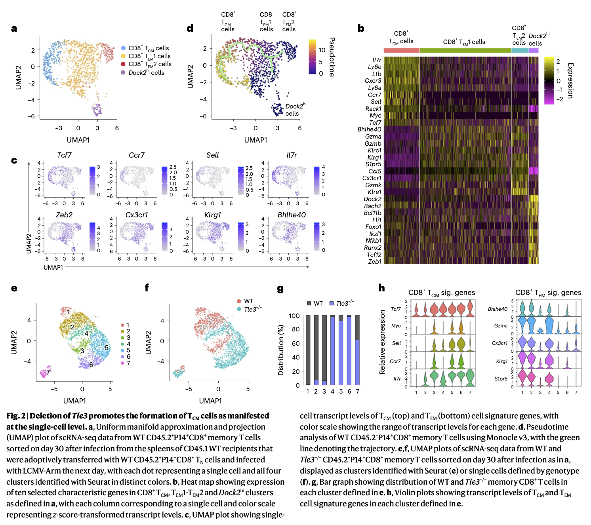
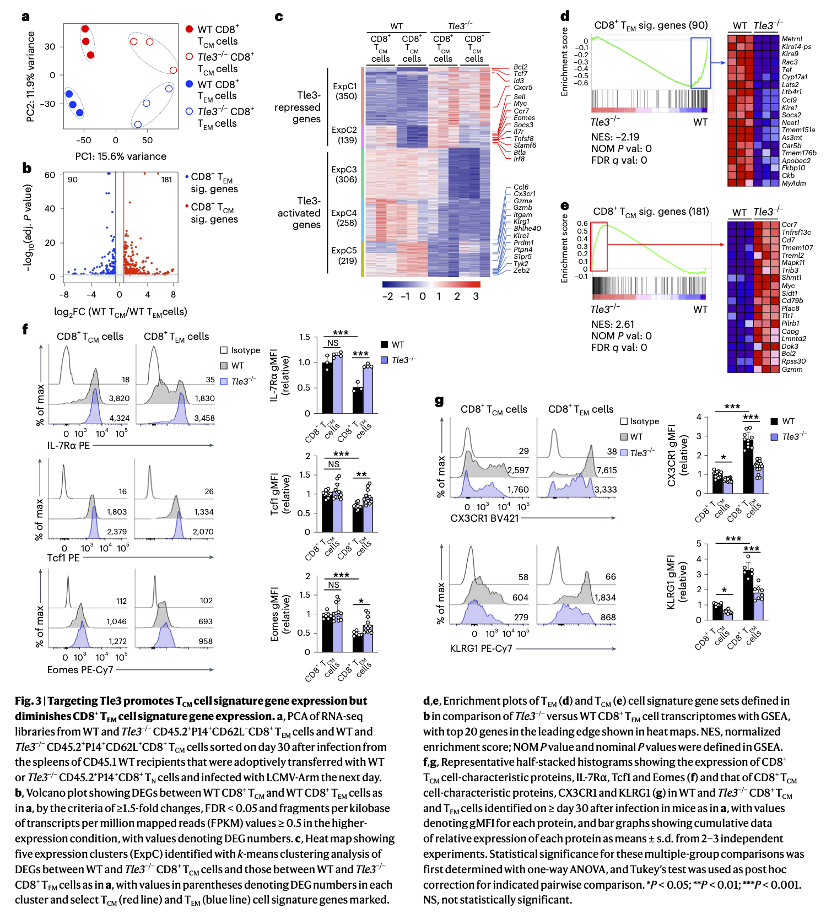
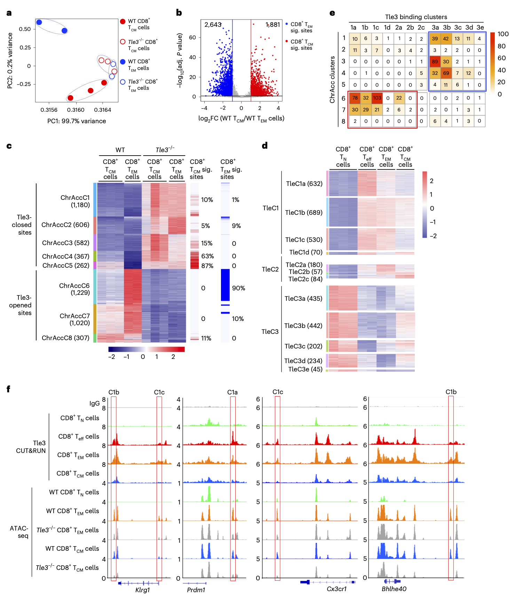
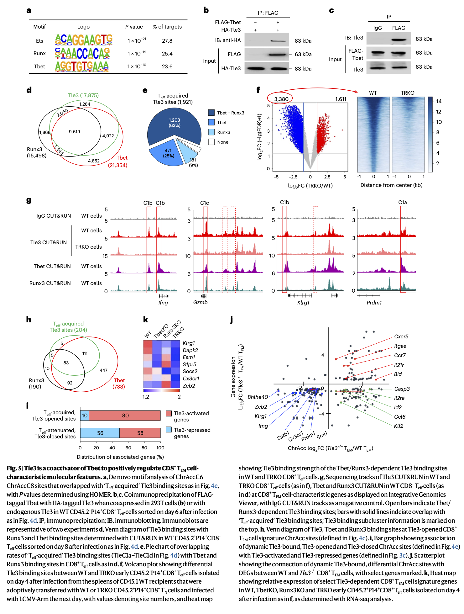
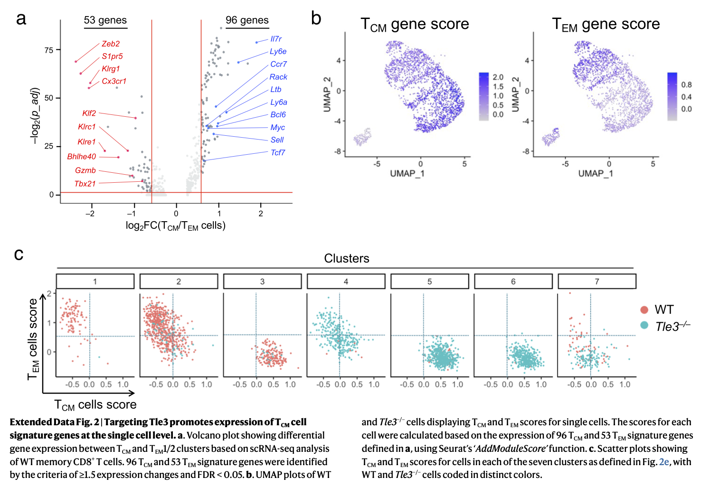
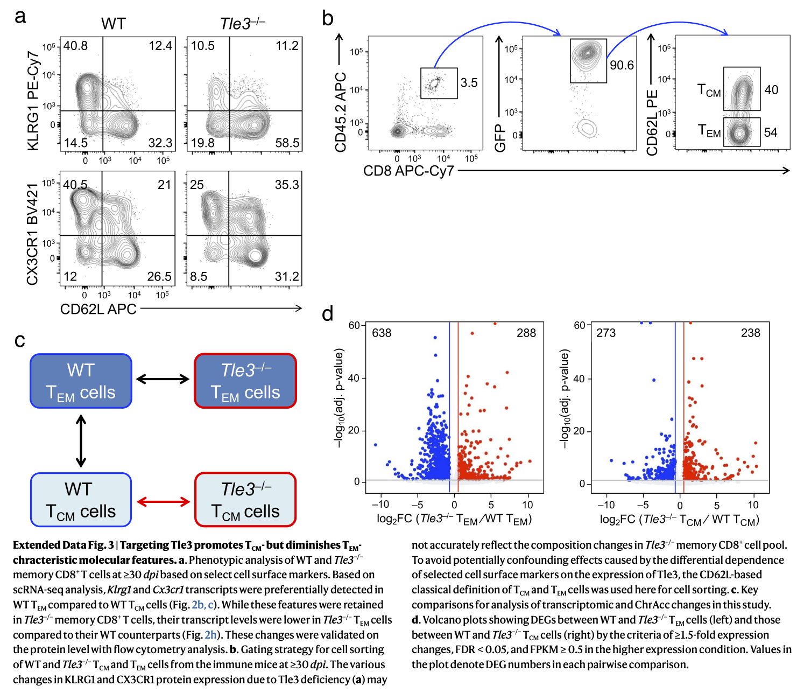
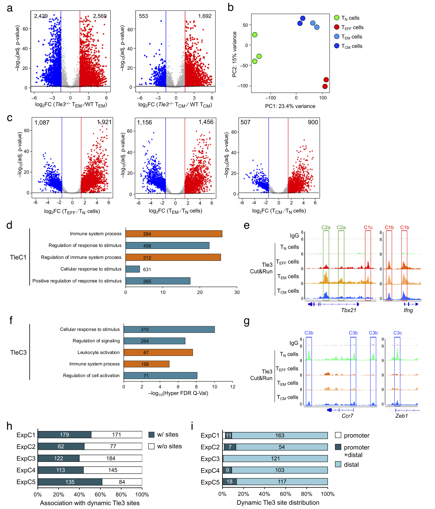

```{r setup, include=FALSE}
knitr::opts_chunk$set(echo=T, eval = F,
                      fig.align = "center", 
                      message=F, warning=F,
                      results = "markup",
                      error = TRUE,
                      highlight = TRUE,
                      prompt = FALSE,
                      tidy = FALSE)
```


```{r, echo=FALSE, eval=T}
library(dplyr)
library(ggplot2)
library(reshape)
```


<a href="https://sung2021.github.io/">Back to Main Page </a>  

## Paper Pdf link   
<a href="../info/papers/NI_Sung_s41590-023-01720-w_reduced_size2.pdf" style="font-size: 16px;">The transcriptional cofactor Tle3 reciprocally controls effector and central memory CD8+ T cell fates. (Nature Immunology, 2024)</a><br>

## Paper info  

* The transcriptional cofactor Tle3 reciprocally controls effector and central memory CD8+ T cell fates. (Nature Immunology, 2024. X.Zhao, W.Hu, S.R.Park, S.Zhu, S.S.Hu, C.Zang, W.Peng, Q.Shan ,H.H. Xue. **co-first** (Zhao, W.Hu, Park and Zhu as co-first authors with equal contribution) (https://doi.org/10.1038/s41590-023-01720-w)<br>
<br><br>

<hr>
## Introduction  

1. **Antigen-Experienced CD8+ T Cells Differentiation**:
   - **TEM (Effector Memory T cells)**
   - **TCM (Central Memory T cells)**

2. **Role of Tle3 in Cell Fate Regulation**:
   - Tle3 is a transcriptional cofactor that critically regulates the fates and lineage stability of TEM and TCM cells through dynamic redistribution in the genome of antigen-responding CD8+ T cells.

3. **Effects of Tle3 Ablation**:
   - Genetic ablation of Tle3 promotes the formation of **CD8+ TCM cells** at the expense of CD8+ TEM cells.
   - Tle3-deficient CD8+ TEM cells show accelerated **conversion into CD8+ TCM cells** while maintaining a robust recall capacity.

4. **Functional Interactions of Tle3**:
   - Previously Tle3 was known as a corepressor.
   - Acts as a **coactivator for Tbet**, enhancing chromatin opening at sites characteristic of CD8+ TEM cells and activating transcription of signature genes for CD8+ TEM cells.
   - **Interacts with Runx3 and Tcf1** to restrain features characteristic of CD8+ TCM cells.

5. **Overall Role of Tle3**:
   - Integrates functions of multiple transcription factors to maintain the lineage fidelity of CD8+ TEM cells.
   - Manipulation of Tle3 activity could be leveraged to favor the production of CD8+ TCM cells.


<hr>
## Fig2  
**Loss of Tle3 enhances CD8+ TCM cell formation**   

```{r, eval=T, echo=FALSE}

```


<br><br>

## Fig3  
**Tle3 promotes TEM and suppresses TCM signature genes**      

```{r, eval=T, echo=FALSE}

```


<br><br>

## Fig4  

**De novo Tle3 binding promotes TEM cell chromatin opening**   
```{r, eval=T, echo=FALSE}

```


<br><br>

## Fig5  

**Tle3 engages Tbet to promote TEM features**   

```{r, eval=T, echo=FALSE}

```


<br><br>


## Extended Data Figures   

### Extended Data Fig2   

```{r, eval=T, echo=FALSE}

```

<br><br>

### Extended Data Fig3   


```{r, eval=T, echo=FALSE}

```


<br><br>

### Extended Data Fig4   

```{r, eval=T, echo=FALSE}

```

<br><br>

<hr>


<span style="font-size: 24px;">Method</span><br>


## Single Cell RNA-seq Data Processing and Cell Clustering Steps

1. **Data Processing**:
   - **Raw reads processing**: Using Drop-seq Laboratory Protocol v3 and Drop-seq Tools (v2.4.1).
   - **Alignment**: Aligned to mm10 mouse genome using STAR (v.2.7.9a).
   - **Gene expression files**: Generated using Drop-Seq Tools (v2.4.1).
   - **UMI Calculation**: Performed using Seurat (v4.1.2).

2. **Quality Control**:
   - Cells with UMI < 1,000 and mitochondrial content > 2.5% were excluded.

3. **Normalization and Transformation**:
   - Normalized UMI counts to count-per-million total counts and log-transformed.

4. **Clustering and Dimension Reduction**:
   - Used 10 principal components for UMAP manifold learning and clustering analyses.
   - Clustering with Seurat's `FindClusters` function (resolution parameter = 0.5).

5. **Marker Gene Identification**:
   - Performed using Seurat's `FindAllMarkers` function.

7. **Data Visualization of gene expression**:
   - Normalized gene expression shown in feature plots or violin plots.
   - Scaled expression data of cluster marker genes in heat maps.

8. **Trajectory Analysis**:
   - Performed using Monocle (v3) to learn a principal graph and order cells along it using `pseudotime` function.

9. **Signature Gene Definition**:
   - TEM1 and TEM2 clusters combined as TEM cells, compared with TCM cluster.
   - Criteria: ≥1.5 expression changes and FDR < 0.05.
   - Identified 96 TCM and 53 TEM signature genes.

10. **Impact Characterization of Tle3 Deficiency**:
    - Pooled WT and Tle3−/− memory CD8+ T cells for UMAP clustering.
    - TCM and TEM scores calculated using Seurat's `AddModuleScore` function and mapped on UMAP or as scatterplots with ggplot2.


## RNA-seq and Data Analysis Process

1. **Sample Collection and Preparation**:
   - **WT and Tle3−/− P14 TCM and TEM Cells**: Sorted from recipient mice at 30–35 days post-infection (d.p.i.) in three biological replicates.
   - **Ex Vivo Cultured Cells**: WT and Tle3ΔCreET TEM cells re-sorted for viable cells, collected in three replicates.
   - **RNA Extraction and Library Construction**: Using TRIzol RNA isolation reagents (Invitrogen/Thermo Fisher Scientific).Performed by Azenta Life Sciences using SMART-Seq HT Ultra Low Input Kit (Clontech/Takara Bio) for cDNA synthesis, and Nextera XT DNA Library Kit (Illumina) for library preparation.

2. **Sequencing and Data Conversion**:
   - **Sequencing and Data Conversion**: Performed on Illumina HiSeq (4000 or equivalent) in paired-end mode with 150 nucleotide read length.Raw .bcl files converted to fastq and de-multiplexed using bcl2fastq 2.17 (Illumina).
   - **Data Deposited**: Bulk RNA-seq data deposited at GEO under SuperSeries GSE213041.

3. **Quality Control and Read Mapping**:
   - **Quality Assessment**: Using FastQC (v0.11.9).
   - **Read Trimming**: Trimmomatic (v.0.39) used to trim 50 bp from the 3′ end to remove low-quality bases.
   - **Read Mapping**: Mapped to the mm10 mouse genome using STAR-2.7.9a, retaining pairs with MAPQ ≥ 30 and ends mapped to the same chromosome.

4. **Gene Expression Analysis**:
   - **Expression Matrix**: Constructed using featureCounts (v.2.0.1).
   - **Expression Estimation**: DESeq2 (v1.32.0) used to estimate gene-level FPKM values.

5. **Differential Expression and Clustering Analysis**:
   - **DEGs Identification**: Criteria of ≥1.5-fold changes, FDR < 0.05, and FPKM ≥ 0.5 in the higher-expression condition.
   - **K-means Clustering**: Applied to define dynamic gene expression patterns from DEGs in three key comparisons.

6. **Signature Analysis and GSEA**:
   - **Signature Definition**: Based on comparative analysis between WT TCM and TEM cell transcriptomes.
   - **GSEA**: Used to measure relative enrichment of custom gene sets in WT and Tle3-deficient TEM cells.


## CUT&RUN Experiment and Data Analysis

1. **Sample Collection and CUT&RUN Protocol**:
   - **Samples**: Naive WT CD8+ T cells, WT Teff (8 days post-infection), WT TEM and TCM cells (≥30 days post-infection), and various deficient conditions for Tbet and Runx3.
   - **Replicates**: Three biological replicates for naive cells, two for most other conditions, and specific counts for deficient condition experiments.
   - **Protocol**: Improved protocol with minor modifications for genome-wide mapping of Tle3, Tbet, and Runx3 binding sites.
   - **Library Preparation and Sequencing**:
     - Quantified using KAPA Library Quantification kit (Roche).
     - Sequenced on Illumina HiSeq 4000 in paired-end mode with 150 nucleotide read length.
   - **Data Depositing**:
     - CUT&RUN data deposited at GEO under SuperSeries GSE213041.

2. **Data Processing**:
   - **Quality Assessment**: FastQC v0.11.9 used to evaluate the sequencing quality.
   - **Read Trimming**: Trimmomatic v0.39 used to retain 36 bp from the 5′ end of sequences.
   - **Read Alignment**: Bowtie2 v2.4.4 aligned sequencing reads to the mm10 mouse genome, retaining only uniquely mapped reads (MAPQ ≥ 30).
   - **File Conversion and Sorting**:
     - SAMtools v1.13 used to convert SAM files to BAM and sort them.
   - **Duplicate Removal**:
     - Picard MarkDuplicates 2.26.0 used to remove duplicate reads in BAM files.
   - **Peak Calling**:
     - MACS v2.2.7.1 used for Tle3 peak calling in paired-end mode (FDR < 0.05).
     - Peaks called using MACS2 applied to pooled reads from biological replicates.


**Reproducibility Analysis and Dynamic Tle3 Binding Cluster Identification (C&R peak analysis)**  


  1. **Union Peaks Creation**: Merged 34,292 union peaks from nine biological replicates across four cell types.  
  2. **Normalization**: Peaks normalized by length per kilobase, libraries by column sum per million; conducted PCA analysis.
  3. **Dynamic Peak Identification**: Generated a 34,292 × 9 matrix for Tle3 binding peaks; used DESeq2 (v.1.32.0) with stringent criteria (≥3-fold changes, FDR < 0.1, peak signal score ≥ 0.7).
  4. **Clustering**: Clustered 3,627 dynamic Tle3 binding peaks using k-means based on expression profiles.
  5. **Peak Calling**: Criteria included ≥2-fold enrichment, FDR < 0.05, excluding peaks found in IgG CUT&RUN samples.
  6. **Comparative Analysis**: Analyzed Tle3 binding strength between WT, TRKO early Teff cells, and WT, TbetKO early Teff cells.
  7. **Annotation**: Used ChIPseeker’s ‘annotatePeak’ to annotate peaks with promoter regions defined as ±1-kb around the TSS.
  8. **Motif Analysis**: Conducted using HOMER (v4.10.0), extracted top motifs including statistics (P value and percentage of targets).
  9. **Functional Annotation**: Employed GREAT (v.4.0.4) to annotate genomic regions with biological functions.


## ATAC-seq Experiment and Data Analysis

1. **Sample Collection and Library Preparation**:
   - **Cells**: WT and Tle3−/− TEM and TCM cells sorted in 2–3 biological replicates; WT or Tle3ΔCreET TEM cells re-sorted for viability.
   - **ATAC-seq Library Sequencing**: Libraries quantified, sequenced on Illumina HiSeq 4000 in paired-end read mode (150 nucleotides).

2. **Data Processing**:
   - **Quality Assessment**: FastQC v0.11.9.
   - **Read Trimming**: Trimmomatic (v0.39) retained 36 bp from the 5′ end.
   - **Alignment**: Bowtie2 (v2.4.4) aligned reads to mm10 mouse genome; only uniquely mapped reads (MAPQ ≥ 30) retained.
   - **Duplicate Removal and File Processing**: SAMtools used to convert and sort BAM files; Picard MarkDuplicates removed duplicates.
   - **Peak Calling**: MACS (v2.2.7.1) for ATAC-seq peak calling, peaks pooled from biological replicates.

3. **Reproducibility Analysis**:
   - **Union Peaks Creation**: 55,158 union peaks created from data across cell types/states, defined as union ChrAcc sites.
   - **Normalization**: Each peak normalized by length per kilobase, libraries normalized by column sum per million; PCA analysis conducted.

4. **Identification of Differential ChrAcc Clusters**:
   - **Analysis**: DESeq2 (v1.32.0) used to identify differential ChrAcc sites between cell types/states.
   - **Criteria for Signature ChrAcc Sites**: ≥2-fold changes, FDR < 0.05, ChrAcc site signal score ≥0.15.
   - **Stringent Criteria for Tle3 Deficiency Impact**: ≥3-fold changes, FDR < 0.05, ChrAcc site signal score ≥0.15.
   - **Clustering**: 5,553 differential ChrAcc sites clustered into eight distinct clusters using k-means clustering.


## Association of Tle3 Binding Sites and Differential ChrAcc Sites with DEGs (C&R + ATAC-seq + RNA-seq Integration)

1. **Assignment Criteria**:
   - **Proximity to TSS**: Sites within ±100-kb of the gene transcription start site (TSS) considered associated with that gene.
   - **Promoter-associated Sites**: Sites within ±1 kb of the TSS designated as promoter-associated.
   - **Distal Sites**: Sites beyond ±1 kb from the TSS designated as distal.

2. **Gene Association**:
   - A single Tle3 binding or ChrAcc site can be associated with multiple unique Refseq genes, reflecting the complex regulatory landscapes of these genomic regions.


## Data Availability

- **GEO Accession Number**: The Tle3 CUT&RUN, bulk RNA-seq, single-cell RNA-seq, and ATAC-seq data from CD8+ T cells are available at the Gene Expression Omnibus (GEO) under the accession number [GSE213041](https://www.ncbi.nlm.nih.gov/geo/query/acc.cgi?acc=GSE213041).


<br>

<hr>

<div style="text-align: right; font-size: 24px;">
    Thank you for reading!
</div>

<br>