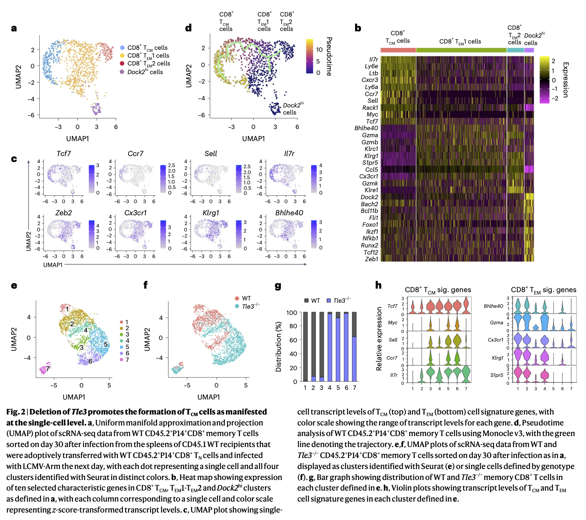
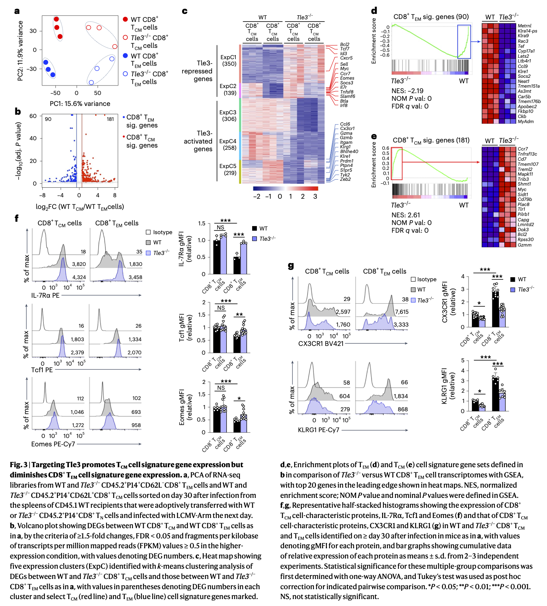
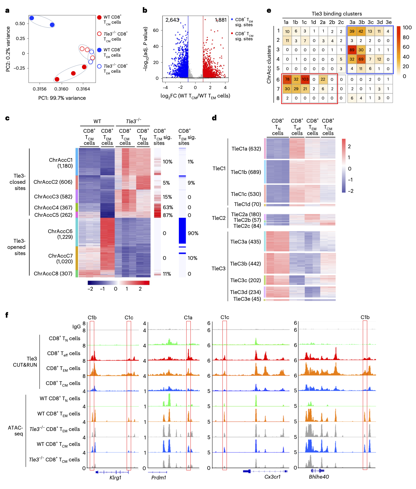
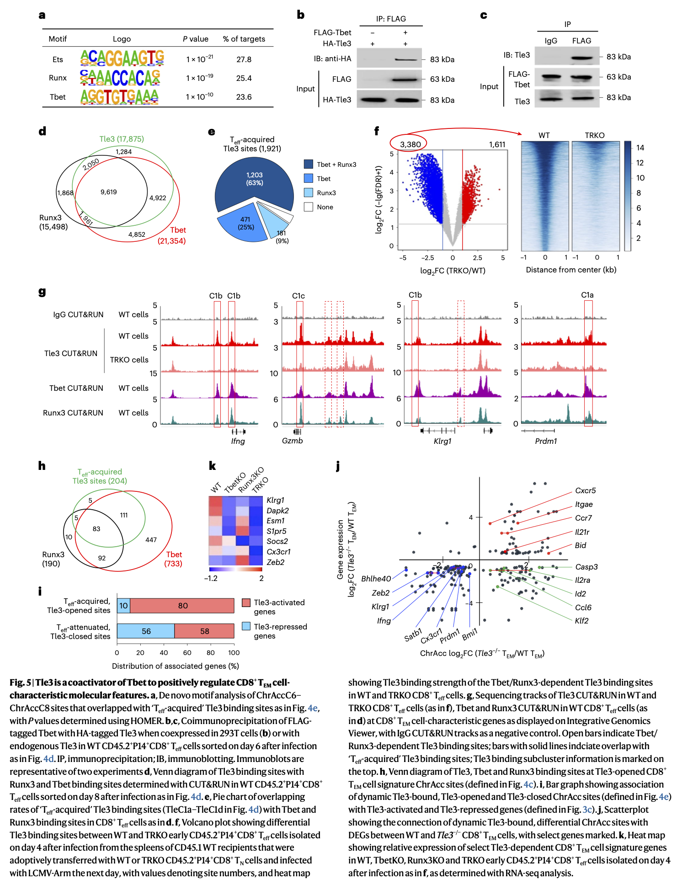
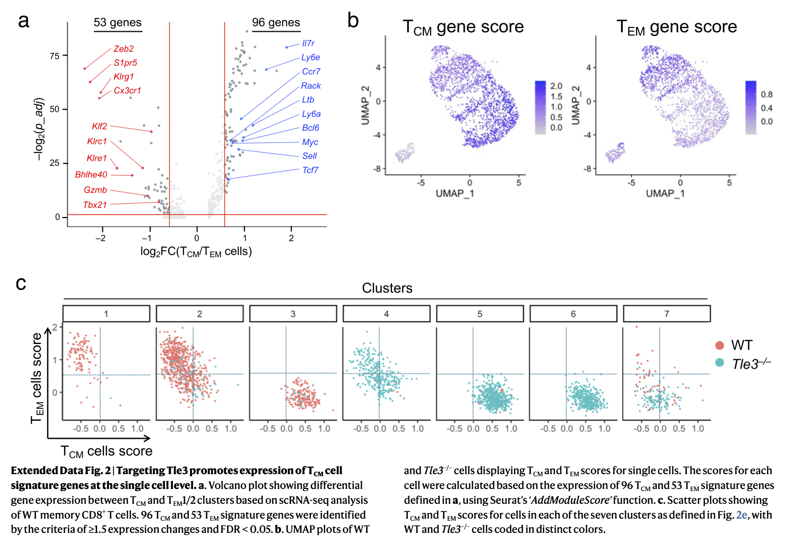
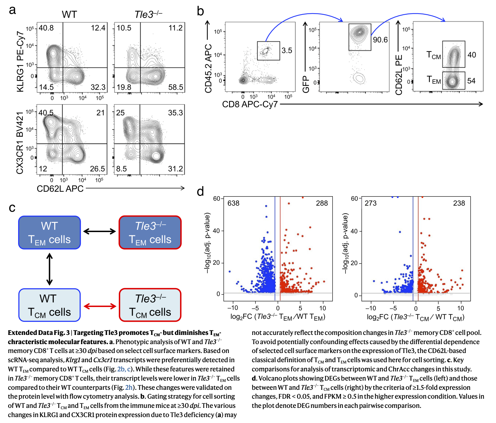
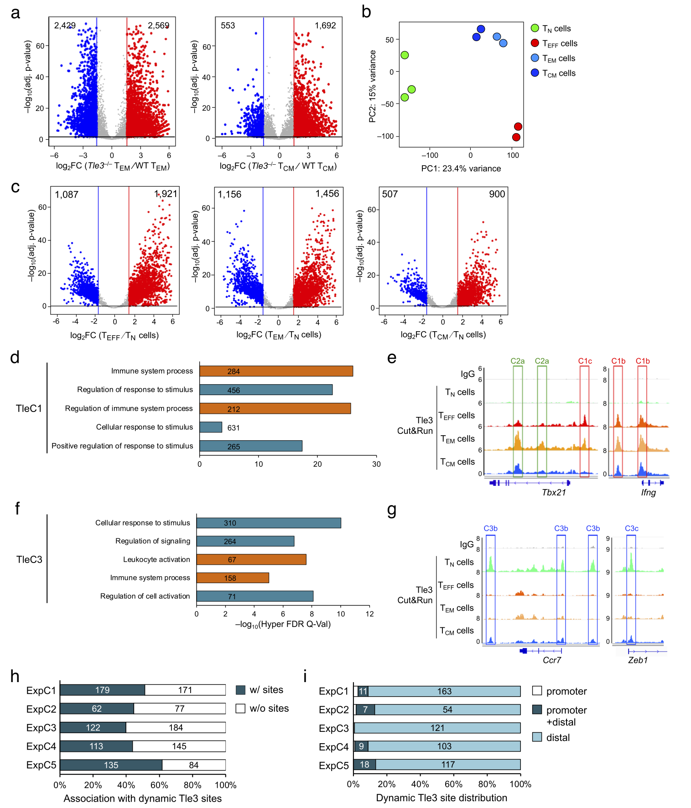

```{r setup, include=FALSE}
knitr::opts_chunk$set(echo=T, eval = F,
                      fig.align = "center", 
                      message=F, warning=F,
                      results = "markup",
                      error = TRUE,
                      highlight = TRUE,
                      prompt = FALSE,
                      tidy = FALSE)
```


```{r, echo=FALSE, eval=T}
library(dplyr)
library(ggplot2)
library(reshape)
```


<a href="https://sung2021.github.io/">Back to Main Page </a>  

## Paper Pdf link   
<a href="../info/papers/NI_Sung_s41590-023-01720-w_reduced_size2.pdf" style="font-size: 16px;">The transcriptional cofactor Tle3 reciprocally controls effector and central memory CD8+ T cell fates. (Nature Immunology, 2024)</a><br>

## Paper info  

* The transcriptional cofactor Tle3 reciprocally controls effector and central memory CD8+ T cell fates. (Nature Immunology, 2024. X.Zhao, W.Hu, S.R.Park, S.Zhu, S.S.Hu, C.Zang, W.Peng, Q.Shan ,H.H. Xue. **co-first** (Zhao, W.Hu, Park and Zhu as co-first authors with equal contribution) (https://doi.org/10.1038/s41590-023-01720-w)<br>
<br><br>

<hr>
## Overview   

**Antigen-Experienced CD8+ T Cells Differentiation:**    

- **Effector Memory T cells (TEM)**: Quick response, peripheral location.    
- **Central Memory T cells (TCM)**: Long-term memory, lymphoid residency.    
    
**Role of Tle3 in Cell Fate Regulation:**    

- **Function**: Tle3 regulates the fate and stability of CD8+ T cells by altering gene distribution.    
- **Effects of Ablation**: Deletion of Tle3 increases TCM formation, accelerating the transition from TEM to TCM while preserving recall ability.    
    
**Functional Dynamics of Tle3:**    

- **As a Corepressor and Coactivator**: Works with Tbet to enhance TEM traits and with Runx3 and Tcf1 to suppress TCM traits.    
- **Overall Impact**: Tle3 ensures lineage fidelity in TEM cells and could be manipulated to increase TCM production.    
    
    
### Key Findings  
    
**Impact of Tle3 Deficiency:**    

- **Shifts Cell Fate**: Deleting Tle3 boosts TCM cell proportions at the expense of TEM cells.    

**Molecular Interactions and Effects:**    

- **Enhances TEM Traits**: Coactivates T-bet to increase chromatin accessibility and gene expression linked to TEM.    
- **Suppresses TCM Traits**: Interacts with Runx3 and Tcf1, limiting TCM characteristics.    
    
    
**Gene Expression Insights:**    

- **Transcriptional Changes**: Tle3 deficiency leads to a transcriptional bias towards TCM, with specific gene signatures highlighting the influence of Tle3 on these profiles.    


<hr>
## Figures  

### Fig2  
**Loss of Tle3 enhances CD8+ TCM cell formation**   

```{r, eval=T, echo=FALSE}

```

#### Exploration of Transcriptional Landscapes:

**Objective and Method**: The goal was to unravel the intricate transcriptional landscapes that differentiate effector memory (TEM) and central memory (TCM) CD8+ T cells. By leveraging single-cell RNA sequencing, we successfully mapped the unique genetic expressions of each subtype, providing a clear delineation based on gene expression clusters.  

#### Detailed Analysis of T Cell Subtypes

**Transcriptional Signatures:**   

- **TCM Cells**: Marked by genes such as Sell (CD62L), Ccr7, Il7r, and Tcf7, these cells are quintessential for maintaining long-term immune memory and facilitating lymphoid organ homing.   
- **TEM Cells**: Comprise two distinct groups:   
  - **TEM1**: Defined by Klrg1 and Cx3cr1, genes associated with direct and potent effector functions.   
  - **Sub-variations**: Notably, some TEM cells express Klre1, indicating a diversity within the effector functions.   
- **Common Attributes of TEM1 and TEM2**: Both subgroups exhibit expression of Zeb2 and Bhlhe40, pivotal in driving T cells toward effector differentiation.   
   
#### Consequences of Tle3 Deletion on Cellular Memory Dynamics       

**Shifts in Cellular Profiles to TCM:**   
The analysis compared wild-type and Tle3-deficient (Tle3−/−) CD8+ T cells, revealing that Tle3 deletion profoundly influenced the UMAP distribution. This resulted in a notable shift of Tle3−/− cells toward TCM-associated characteristics, suggesting a pivotal role of Tle3 in balancing effector and memory phenotypes.    


#### Note  

By characterizing the TEM and TCM features directly from same experimental setups, we gained deeper insights into Tle3's regulatory functions on gene expression. This approach not only ensured a consistent analytical framework but also enriched our understanding of how gene regulatory mechanisms can be manipulated to influence T cell fate decisions.   

<br><br>

### Fig3  

**Tle3 promotes TEM and suppresses TCM signature genes**      

```{r, eval=T, echo=FALSE}

```
<br>

#### TCM signature genes and 90 TEM signature genes from RNA-seq data  

- We identifies 181 TCM signature genes and 90 TEM signature genes, which are differentially expressed with statistical significance.  
- Genes such as Id3, Eomes, Irf8, and Vcam1 are highlighted as part of the TCM signature, while Cx3cr1 and Klrg1 are noted in the TEM signature.  
  
#### The loss of Tle3 alters the TCM/TEM signatures.  

- A depletion of TEM signature genes in Tle3−/− CD8+ TEM cells compared to WT.  
- The loss of Tle3 leads to a significant downregulation of genes typically associated with the TEM phenotype.  
- The absence of Tle3 promotes a shift towards a TCM-like transcriptional profile in these cells.   

#### Clustering analysis of DEGs between WT and Tle3−/− CD8+ TCM and TEM cells.  

- The DEGs into five expression clusters (ExpC1 to ExpC5)   

- **ExpC1 (Tle3-Repressed Genes in TCM Cells)**:   
  - **Genes**: Bcl2, Tcf7, Id3, Cxcr5, Sell, Myc, Ccr7, Eomes, Socs3, Il7r, Tnfsf8, Slamf6, Btla, Irf8   
  - **Characteristics**: These genes are upregulated in Tle3-deficient CD8+ TCM cells, indicating a suppressive role of Tle3 on these genes in wild-type cells.   

- **ExpC2 (Tle3-Repressed Genes in TEM Cells)**:   
  - **Genes**: Ccl6, Cx3cr1, Gzma, Gzmb, Itgam, Klrg1, Bhlhe40, Klre1, Prdm1, Ptpn4, S1pr5, Tyk2, Zeb2   
  - **Characteristics**: These genes show increased expression in Tle3-deficient CD8+ TEM cells, suggesting they are normally repressed by Tle3 in effector memory settings.   

- **ExpC3 (Tle3-Activated Genes in TCM Cells)**:   
  - **Genes**: Rack1, Myc, Tcf7, Sell, Ccr7, Il7r   
  - **Characteristics**: Lower expression in Tle3-deficient cells indicates that Tle3 typically promotes these genes in wild-type CD8+ TCM cells.   

- **ExpC4 (Tle3-Activated Genes in TEM Cells)**:   
  - **Genes**: Cx3cr1, Klrg1, Gzma, S1pr5, Bhlhe40   
  - **Characteristics**: These genes are less expressed in Tle3−/− CD8+ TEM cells, showing that Tle3 normally enhances their expression.   

- **ExpC5 (Mixed Expression in TCM and TEM Cells)**:   
  - **Genes**: Not specified for distinct cell types but include a mix affected in both TCM and TEM cells by Tle3 status.   
  - **Characteristics**: Represents a diverse set of genes that are differentially regulated by Tle3 across both memory and effector phenotypes.   
  
  
#### Protein level changes 

The downregulation of TEM genes and the corresponding decrease in TEM protein expression in Tle3−/− cells, combined with the upregulation of TCM genes and increased expression of TCM-related proteins, highlight Tle3's pivotal role in maintaining the effector memory phenotype while suppressing the central memory phenotype. By affecting both gene and protein levels, Tle3 helps maintain the balance and functional specificity of different CD8+ T cell subsets. 
  
<br><br>

### Fig4  

**De novo Tle3 binding promotes TEM cell chromatin opening**   
```{r, eval=T, echo=FALSE}

```


#### Clustering of Chromatin Accessibility Sites  
<br>

- **Differentially accessible chromatin regions**  into 8 clusters (ChrAccC1 to ChrAccC8).  


| Cluster | Changes in Accessibility | Implications | Impact on Signature Sites |
|---------|---------------|-----------------------|-------------|
| ChrAccC1 | Increased in Tle3−/−     | Tle3 normally suppresses accessibility, impacting genes related to T cell activation or suppression. | Upregulation of TCM genes such as Sell, Ccr7 |
| ChrAccC2 | Increased in Tle3−/−     | Tle3 acts as a repressor in these regions, potentially influencing genes important for T cell effector functions. | No significant impact on signature genes |
| ChrAccC3 | Mixed, slightly increased in Tle3−/− | Tle3 has a nuanced role in modulating accessibility, affecting genes involved in activation and memory retention. | No significant impact on signature genes |
| ChrAccC4 | Decreased in Tle3−/−     | Tle3 enhances accessibility, promoting genes associated with T cell effector status and rapid response capabilities. | Downregulation of TEM genes such as Cx3cr1, Klrg1 |
| ChrAccC5 | Decreased in Tle3−/−     | Tle3 maintains open chromatin states at these sites, crucial for genes linked to immediate immune responses. | Downregulation of TEM genes such as Prdm1, Bhlhe40 |
| ChrAccC6 | Mixed, less pronounced changes | Tle3 has a more complex regulatory role, affecting genes in T cell development and differentiation. | No significant impact on signature genes |
| ChrAccC7 | Decreased in Tle3−/−     | Tle3's absence leads to tighter chromatin, repressing genes critical for T cell survival and long-term memory. | Upregulation of TCM genes such as Sell, Ccr7 |
| ChrAccC8 | Decreased in Tle3−/−     | Tle3 facilitates chromatin opening, essential for sustaining mature T cell functions and longevity. | Upregulation of TCM genes such as Tcf7, Il7r |


#### Clustering of Differential binding Sites  
<br>

- **Differential bindings of Tle3 ** into 3 clusters roughly (TleC1 to TleC3).  
   
| Cluster | Description |
|-------|------------------------|
| **TleC1 - 'Teff-acquired sites'** | In CD8+ TN cells, Tle3 binding starts weak but strengthens significantly in CD8+ Teff cells, retains in CD8+ TEM cells, but is attenuated in CD8+ TCM cells. |
| **TleC2 - 'TM-preferred sites'** | Tle3 binding is minimal in CD8+ TN cells but increases in CD8+ TEM and CD8+ TCM cells, surpassing levels observed in CD8+ Teff cells. |
| **TleC3 - 'Teff-attenuated sites'** | Strong Tle3 binding in CD8+ TN cells diminishes in CD8+ Teff cells but is partially restored in CD8+ TCM cells, suggesting a regulatory shift favorable to memory characteristics. |


#### Tle3-Opened and Tle3-Closed Chromatin Sites to Tle3 binding  

- **Tle3-Opened Sites**: Chromatin sites in ChrAccC6 and ChrAccC7 are noted as being highly enriched in 'Teff-acquired' Tle3 binding sites (TleC1a–TleC1c). This suggests that in these Tle3 binding sites are likely conducive to transcriptional activity in **Teff** cells.   

- **Tle3-Closed Sites**: Conversely, chromatin sites in ChrAccC1–ChrAccC5 frequently overlap with 'Teff-attenuated' Tle3 binding sites (TleC3a–TleC3d), indicating that Tle3 binding in these regions correlates with a closed chromatin state, which might inhibit transcription in these areas.   


<br><br>

### Fig5  

**Tle3 engages Tbet to promote TEM features**   

```{r, eval=T, echo=FALSE}

```


<br><br>


## Extended Data Figures   

### Extended Data Fig2   

```{r, eval=T, echo=FALSE}

```

<br><br>

### Extended Data Fig3   


```{r, eval=T, echo=FALSE}

```


<br><br>

### Extended Data Fig4   

```{r, eval=T, echo=FALSE}

```

<br><br>

<hr>


<span style="font-size: 24px;">Method</span><br>


## Method  

### Single Cell RNA-seq Data Processing and Cell Clustering Steps

1. **Data Processing**:
   - **Raw reads processing**: Using Drop-seq Laboratory Protocol v3 and Drop-seq Tools (v2.4.1).
   - **Alignment**: Aligned to mm10 mouse genome using STAR (v.2.7.9a).
   - **Gene expression files**: Generated using Drop-Seq Tools (v2.4.1).
   - **UMI Calculation**: Performed using Seurat (v4.1.2).

2. **Quality Control**:
   - Cells with UMI < 1,000 and mitochondrial content > 2.5% were excluded.

3. **Normalization and Transformation**:
   - Normalized UMI counts to count-per-million total counts and log-transformed.

4. **Clustering and Dimension Reduction**:
   - Used 10 principal components for UMAP manifold learning and clustering analyses.
   - Clustering with Seurat's `FindClusters` function (resolution parameter = 0.5).

5. **Marker Gene Identification**:
   - Performed using Seurat's `FindAllMarkers` function.

7. **Data Visualization of gene expression**:
   - Normalized gene expression shown in feature plots or violin plots.
   - Scaled expression data of cluster marker genes in heat maps.

8. **Trajectory Analysis**:
   - Performed using Monocle (v3) to learn a principal graph and order cells along it using `pseudotime` function.

9. **Signature Gene Definition**:
   - TEM1 and TEM2 clusters combined as TEM cells, compared with TCM cluster.
   - Criteria: ≥1.5 expression changes and FDR < 0.05.
   - Identified 96 TCM and 53 TEM signature genes.

10. **Impact Characterization of Tle3 Deficiency**:
    - Pooled WT and Tle3−/− memory CD8+ T cells for UMAP clustering.
    - TCM and TEM scores calculated using Seurat's `AddModuleScore` function and mapped on UMAP or as scatterplots with ggplot2.


### RNA-seq and Data Analysis Process

1. **Sample Collection and Preparation**:
   - **WT and Tle3−/− P14 TCM and TEM Cells**: Sorted from recipient mice at 30–35 days post-infection (d.p.i.) in three biological replicates.
   - **Ex Vivo Cultured Cells**: WT and Tle3ΔCreET TEM cells re-sorted for viable cells, collected in three replicates.
   - **RNA Extraction and Library Construction**: Using TRIzol RNA isolation reagents (Invitrogen/Thermo Fisher Scientific).Performed by Azenta Life Sciences using SMART-Seq HT Ultra Low Input Kit (Clontech/Takara Bio) for cDNA synthesis, and Nextera XT DNA Library Kit (Illumina) for library preparation.

2. **Sequencing and Data Conversion**:
   - **Sequencing and Data Conversion**: Performed on Illumina HiSeq (4000 or equivalent) in paired-end mode with 150 nucleotide read length.Raw .bcl files converted to fastq and de-multiplexed using bcl2fastq 2.17 (Illumina).
   - **Data Deposited**: Bulk RNA-seq data deposited at GEO under SuperSeries GSE213041.

3. **Quality Control and Read Mapping**:
   - **Quality Assessment**: Using FastQC (v0.11.9).
   - **Read Trimming**: Trimmomatic (v.0.39) used to trim 50 bp from the 3′ end to remove low-quality bases.
   - **Read Mapping**: Mapped to the mm10 mouse genome using STAR-2.7.9a, retaining pairs with MAPQ ≥ 30 and ends mapped to the same chromosome.

4. **Gene Expression Analysis**:
   - **Expression Matrix**: Constructed using featureCounts (v.2.0.1).
   - **Expression Estimation**: DESeq2 (v1.32.0) used to estimate gene-level FPKM values.

5. **Differential Expression and Clustering Analysis**:
   - **DEGs Identification**: Criteria of ≥1.5-fold changes, FDR < 0.05, and FPKM ≥ 0.5 in the higher-expression condition.
   - **K-means Clustering**: Applied to define dynamic gene expression patterns from DEGs in three key comparisons.

6. **Signature Analysis and GSEA**:
   - **Signature Definition**: Based on comparative analysis between WT TCM and TEM cell transcriptomes.
   - **GSEA**: Used to measure relative enrichment of custom gene sets in WT and Tle3-deficient TEM cells.


### CUT&RUN Experiment and Data Analysis

1. **Sample Collection and CUT&RUN Protocol**:
   - **Samples**: Naive WT CD8+ T cells, WT Teff (8 days post-infection), WT TEM and TCM cells (≥30 days post-infection), and various deficient conditions for Tbet and Runx3.
   - **Replicates**: Three biological replicates for naive cells, two for most other conditions, and specific counts for deficient condition experiments.
   - **Protocol**: Improved protocol with minor modifications for genome-wide mapping of Tle3, Tbet, and Runx3 binding sites.
   - **Library Preparation and Sequencing**:
     - Quantified using KAPA Library Quantification kit (Roche).
     - Sequenced on Illumina HiSeq 4000 in paired-end mode with 150 nucleotide read length.
   - **Data Depositing**:
     - CUT&RUN data deposited at GEO under SuperSeries GSE213041.

2. **Data Processing**:
   - **Quality Assessment**: FastQC v0.11.9 used to evaluate the sequencing quality.
   - **Read Trimming**: Trimmomatic v0.39 used to retain 36 bp from the 5′ end of sequences.
   - **Read Alignment**: Bowtie2 v2.4.4 aligned sequencing reads to the mm10 mouse genome, retaining only uniquely mapped reads (MAPQ ≥ 30).
   - **File Conversion and Sorting**:
     - SAMtools v1.13 used to convert SAM files to BAM and sort them.
   - **Duplicate Removal**:
     - Picard MarkDuplicates 2.26.0 used to remove duplicate reads in BAM files.
   - **Peak Calling**:
     - MACS v2.2.7.1 used for Tle3 peak calling in paired-end mode (FDR < 0.05).
     - Peaks called using MACS2 applied to pooled reads from biological replicates.


**Reproducibility Analysis and Dynamic Tle3 Binding Cluster Identification (C&R peak analysis)**  


  1. **Union Peaks Creation**: Merged 34,292 union peaks from nine biological replicates across four cell types.  
  2. **Normalization**: Peaks normalized by length per kilobase, libraries by column sum per million; conducted PCA analysis.
  3. **Dynamic Peak Identification**: Generated a 34,292 × 9 matrix for Tle3 binding peaks; used DESeq2 (v.1.32.0) with stringent criteria (≥3-fold changes, FDR < 0.1, peak signal score ≥ 0.7).
  4. **Clustering**: Clustered 3,627 dynamic Tle3 binding peaks using k-means based on expression profiles.
  5. **Peak Calling**: Criteria included ≥2-fold enrichment, FDR < 0.05, excluding peaks found in IgG CUT&RUN samples.
  6. **Comparative Analysis**: Analyzed Tle3 binding strength between WT, TRKO early Teff cells, and WT, TbetKO early Teff cells.
  7. **Annotation**: Used ChIPseeker’s ‘annotatePeak’ to annotate peaks with promoter regions defined as ±1-kb around the TSS.
  8. **Motif Analysis**: Conducted using HOMER (v4.10.0), extracted top motifs including statistics (P value and percentage of targets).
  9. **Functional Annotation**: Employed GREAT (v.4.0.4) to annotate genomic regions with biological functions.


### ATAC-seq Experiment and Data Analysis

1. **Sample Collection and Library Preparation**:
   - **Cells**: WT and Tle3−/− TEM and TCM cells sorted in 2–3 biological replicates; WT or Tle3ΔCreET TEM cells re-sorted for viability.
   - **ATAC-seq Library Sequencing**: Libraries quantified, sequenced on Illumina HiSeq 4000 in paired-end read mode (150 nucleotides).

2. **Data Processing**:
   - **Quality Assessment**: FastQC v0.11.9.
   - **Read Trimming**: Trimmomatic (v0.39) retained 36 bp from the 5′ end.
   - **Alignment**: Bowtie2 (v2.4.4) aligned reads to mm10 mouse genome; only uniquely mapped reads (MAPQ ≥ 30) retained.
   - **Duplicate Removal and File Processing**: SAMtools used to convert and sort BAM files; Picard MarkDuplicates removed duplicates.
   - **Peak Calling**: MACS (v2.2.7.1) for ATAC-seq peak calling, peaks pooled from biological replicates.

3. **Reproducibility Analysis**:
   - **Union Peaks Creation**: 55,158 union peaks created from data across cell types/states, defined as union ChrAcc sites.
   - **Normalization**: Each peak normalized by length per kilobase, libraries normalized by column sum per million; PCA analysis conducted.

4. **Identification of Differential ChrAcc Clusters**:
   - **Analysis**: DESeq2 (v1.32.0) used to identify differential ChrAcc sites between cell types/states.
   - **Criteria for Signature ChrAcc Sites**: ≥2-fold changes, FDR < 0.05, ChrAcc site signal score ≥0.15.
   - **Stringent Criteria for Tle3 Deficiency Impact**: ≥3-fold changes, FDR < 0.05, ChrAcc site signal score ≥0.15.
   - **Clustering**: 5,553 differential ChrAcc sites clustered into eight distinct clusters using k-means clustering.


### Association of Tle3 Binding Sites and Differential ChrAcc Sites with DEGs (C&R + ATAC-seq + RNA-seq Integration)

1. **Assignment Criteria**:
   - **Proximity to TSS**: Sites within ±100-kb of the gene transcription start site (TSS) considered associated with that gene.
   - **Promoter-associated Sites**: Sites within ±1 kb of the TSS designated as promoter-associated.
   - **Distal Sites**: Sites beyond ±1 kb from the TSS designated as distal.

2. **Gene Association**:
   - A single Tle3 binding or ChrAcc site can be associated with multiple unique Refseq genes, reflecting the complex regulatory landscapes of these genomic regions.


## Data Availability

- **GEO Accession Number**: The Tle3 CUT&RUN, bulk RNA-seq, single-cell RNA-seq, and ATAC-seq data from CD8+ T cells are available at the Gene Expression Omnibus (GEO) under the accession number [GSE213041](https://www.ncbi.nlm.nih.gov/geo/query/acc.cgi?acc=GSE213041).


<br>

<hr>

<div style="text-align: right; font-size: 24px;">
    Thank you for reading!
</div>

<br>