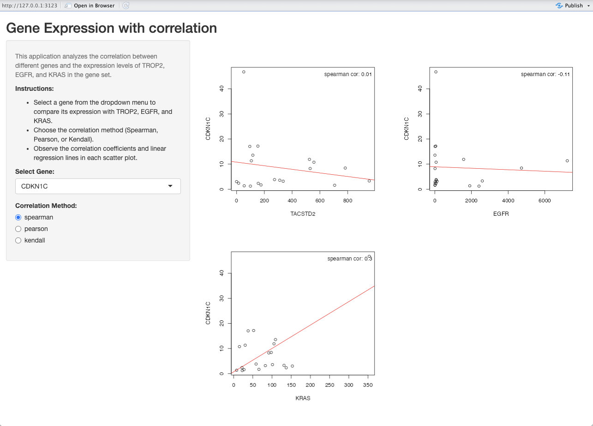

```{r setup, include=FALSE}
knitr::opts_chunk$set(echo=T, fig.align = "center", 
                      eval = F,
                      message=F, warning=F,
                      results = "markup",
                      error = TRUE,
                      highlight = TRUE,
                      prompt = FALSE,
                      tidy = FALSE)
```

<a href="https://sung2021.github.io/">Back to Main Page </a>  
[other example](https://sung2021.github.io/samplePages/Simple_RShiny_app_gene_gene_scatterplot.html)
<br>

# Introduction 

This is a simple R Shiny app including scatter plots with the selection of correlation methods.  
This is **AN EXAMPLE** for the app structure (definition of functions, ui, server).   
Local run only.  


# Load the Shiny library

```{r}
library(shiny)
library(dplyr)
library(ggplot2)
```


# Set the data directory

```{r}
dir <- "~/Desktop/figure/"
tpm = read.csv(paste0(dir,"your_tpm_file"), row.names = 1)
```


# Create functions  
```{r}
# Create functions
scatterplot <- function(tpm, gene_x, gene_y, method = "spearman") {
  subset_df <- data.frame(t(tpm[c(gene_x, gene_y), ]))
  plot(subset_df[, 1], subset_df[, 2], xlab = gene_x, ylab = gene_y)
  correlation_coefficient <- cor(subset_df[, 1], subset_df[, 2], method = method)
  abline(lm(subset_df[, 2] ~ subset_df[, 1]), col = "red")
  legend("topright", legend = paste(method, "cor:", round(correlation_coefficient, 2)), bty = "n")
}
```

# Define the UI
```{r}
# Define the UI
ui <- fluidPage(
  # App title
  titlePanel("Gene Expression with correlation"),
  
  # Sidebar layout
  sidebarLayout(
    sidebarPanel(
      # Add descriptive information
      helpText(
        "This application analyzes the correlation between different genes and the expression levels of TROP2, EGFR, and KRAS in the ADC gene set."
      ),
      tags$div(
        HTML(
          "<p><strong>Instructions:</strong></p>
          <ul>
            <li>Select a gene from the dropdown menu to compare its expression with TROP2, EGFR, and KRAS.</li>
            <li>Choose the correlation method (Spearman, Pearson, or Kendall).</li>
            <li>Observe the correlation coefficients and linear regression lines in each scatter plot.</li>
          </ul>"
        )
      ),
      
      # Gene selection for scatter plots
      selectInput("y_gene", "Select Gene:", choices = rownames(tpm)),
      radioButtons("correlation_method", "Correlation Method:", choices = c("spearman", "pearson", "kendall"))
    ),
    
    mainPanel(
      fluidRow(
        column(width = 6, plotOutput("scatterplot_trop2")),
        column(width = 6, plotOutput("scatterplot_egfr"))
      ),
      fluidRow(
        column(width = 6, plotOutput("scatterplot_kras"))
      )
    )
  )
)

```


# Define the server
```{r}
server <- function(input, output) {
  # Generate TROP2 plot
  output$scatterplot_trop2 <- renderPlot({
    scatterplot(tpm, "TACSTD2", input$y_gene, method = input$correlation_method)
  })
  
  # Generate EGFR plot
  output$scatterplot_egfr <- renderPlot({
    scatterplot(tpm, "EGFR", input$y_gene, method = input$correlation_method)
  })
  
  # Generate KRAS plot
  output$scatterplot_kras <- renderPlot({
    scatterplot(tpm, "KRAS", input$y_gene, method = input$correlation_method)
  })
}
```

# Run the Shiny app 
```{r}
shinyApp(ui = ui, server = server)
```


# Output will be like this    

<br>
 
<br>

<br><br>

